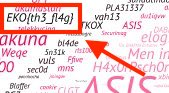

# Hidden Inside EKO

### Challenge
**Competition:** EKOPARTY CTF 2016
**Category:** Misc
**Points:** 50

> Find the hidden flag in the EKO pixels!


### Solution

This was a straightforward challenge and an easy way to grab some points.  The background image that the CTF website used was full of different words in different orientations and sizes, and I thought for sure the challenge text was referencing that image.  I downloaded the image, and after a quick visual scan, I found the flag written plainly in the image:




### Flag

```none
EKO{th3_fl4g}
```