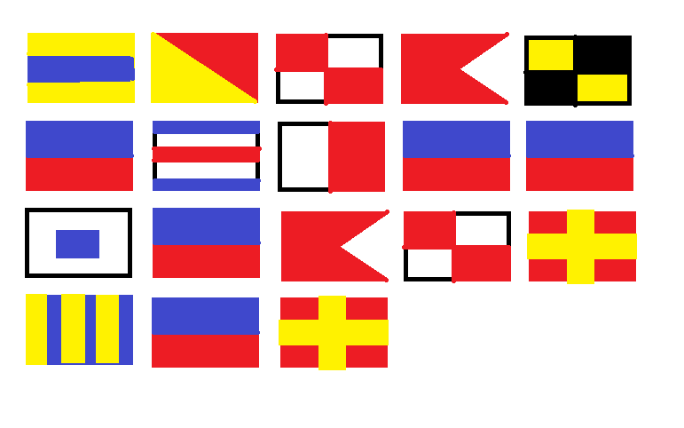

# You Got Flags

### Challenge
- **Competition:** FIT-HACK 2017
- **Category:** Misc
- **Points:** 50
- **File:** flags.png

> What's this illust？

### Solution
The given .png file showed illustrations of several [signal flags](https://en.wikipedia.org/wiki/International_maritime_signal_flags).



'Decoding' the flags into their alphabetic representation gives the following:

```none
D O U B L
E C H E E
S E B U R
G E R
```

Putting it all together, the flag is DOUBLECHEESEBURGER.

### Flag

`FIT{DOUBLECHEESEBURGER}`