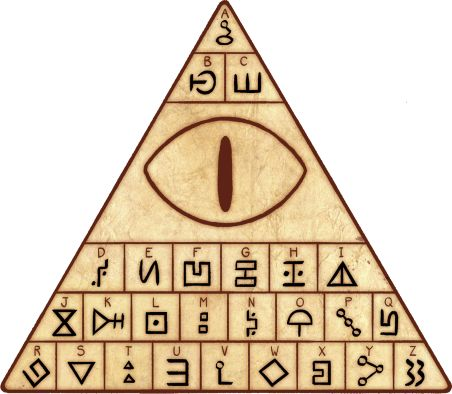

# Here Goes!

### Challenge
- **Competition:** Juniors CTF 2016
- **Category:** Trivial Crypto Recon

This challenge starts by giving the following image with some sort of intentional cryptic characters:


### Solution

This whole CTF was themed around a TV show called Gravity Falls.  After a quick Google search for something like 'Gravity Falls decrypt', I found the following image which allowed me to decrypt the original message:



The decrypted message was:

```none
FIXPROB
LEMQUIC
KLYWITH
GALVANI
ZEDJETS
```
The flag was just all of this text as a single string with no spaces.

### Flag

`FIXPROBLEMQUICKLYWITHGALVANIZEDJETS`