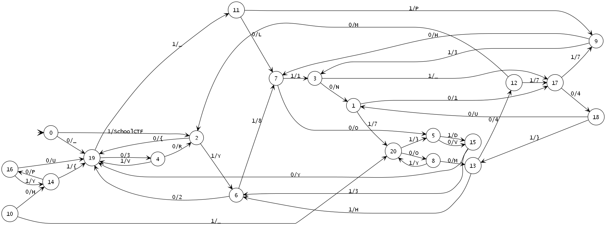

# The Magnificent Five

### Challenge
- **Competition:** School CTF 2016
- **Category:** Joy
- **Points:** 400


> OMG, that crazy Russians launched a UFO into Space. We have managed to steal its diagram and the launch commands. Can you deal with the algorithm and send us its output?
>
>Launch command: 10010011010100010110100111001000101

### Solution

This 'joy' challenge was extremely simple, but a good way to grab some very quick points.  The supplied image was sort of a road map which was meant to be traversed with the 'launch code' from the challenge text as the step by step directions.  The 'road map' consisted of nodes and connecting lines.  Each connecting line was labelled with either a 1 or a 0 and another character or several characters.  Using the 'launch command' to move from node to node, the flag ends up being the extra character or characters along the connecting lines.

Click the image for a better look at it:

[](/img/2016/schoolctf-2016-themagnificentfive.png)


Each bit of the binary 'launch' code corresponded to the character beneath it (the first bit corresponded the "SchoolCTF"):

```none
1        0010011010100010110100111001000101
SchoolCTF{3V3RY8ODY_LOV32_PH1N173_4U7OM474}
```

### Flag

`SchoolCTF{3V3RY8ODY_LOV32_PH1N173_4U7OM474}`