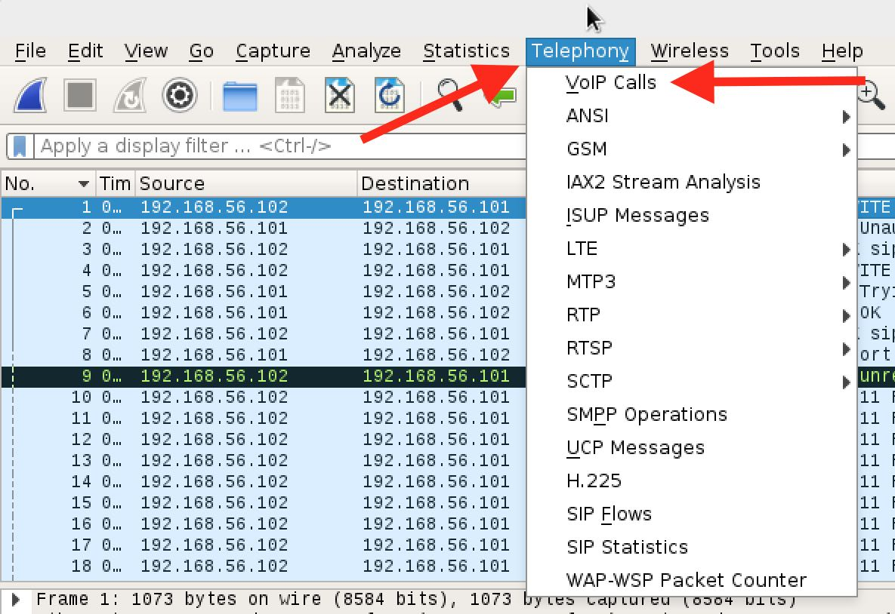
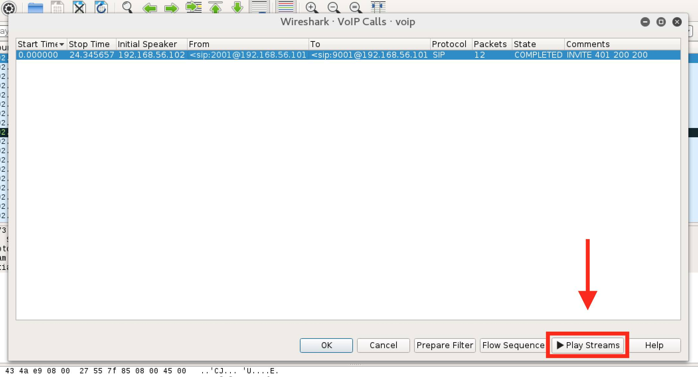
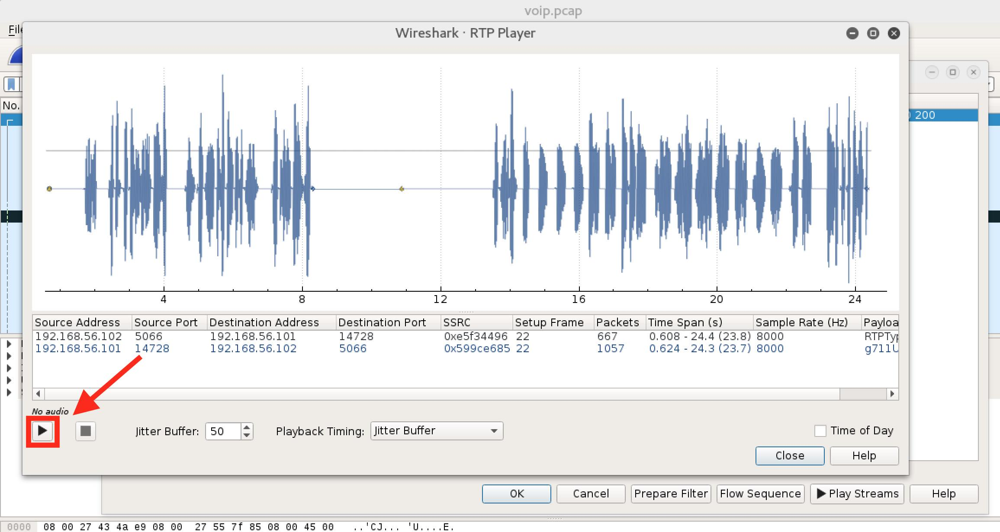

# VoIP

### Challenge
- **Competition:** SECCON CTF 2016
- **Category:** Forensics
- **Points:** 100
- **File:** [voip.pcap](./files/voip.pcap)

> VoIP
>
> Extract a voice.
> The flag format is SECCON{[A-Z0-9]}.

### Solution

This was an extremely interesting introduction to a feature of Wireshark that can reconstruct audio of VoIP calls.  

First, open the __Telephony__ menu, then click __VoIP Calls__.

In the next popup window, highlight the stream and click the __Play Streams__ button.

In the final popup window, click the play button (triangle shape) to playback the audio of the VoIP call.

The audio read back the flag in a robotic text-to-speech voice.

### Flag

`SECCON{9001IVR}`